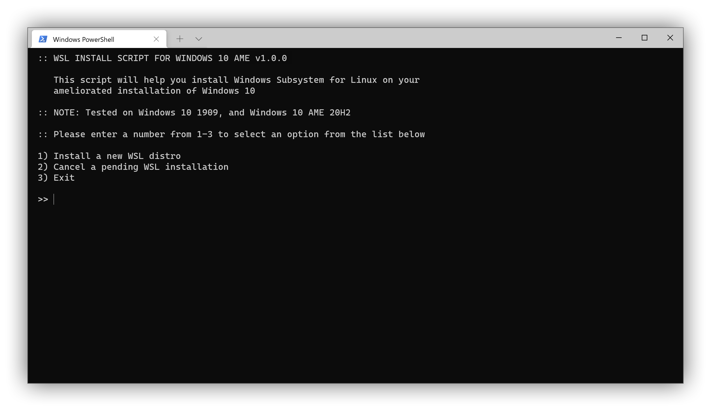

# install-wsl

Script for installing WSL on Windows 10 AME.



## Downloading and Running

To get this script, simply head over to [releases](https://git.ameliorated.info/LoganDark/install-wsl/releases) and download the latest release. You can also clone this repo:

    git clone https://git.ameliorated.info/LoganDark/install-wsl.git

To run a script in CMD or Powershell, enter the path of the script and press return:

    C:\Users\user> "Downloads\install-wsl\install-wsl.bat"

## Flags for non-interactive Installations

This script also includes extra flags for non-interactive insallations. They can be viewed by specifying the `--help` flag.

```
Usage: install-wsl.bat --help
    Displays all possible invocations of this script and brief descriptions of
    each.

Usage: install-wsl.bat --install <distro> [--quiet]
    Begins installing the given distribution. If the --quiet flag is given then
    no output will be printed. If the Windows Subsystem for Linux is not
    installed, it will be enabled and a startup item will be created to resume
    the installation on reboot.

    Valid distributions:
      wslubuntu2004, wslubuntu2004arm, wsl-ubuntu-1804, wsl-ubuntu-1804-arm,
      wsl-ubuntu-1604, wsl-debian-gnulinux, wsl-kali-linux-new, wsl-opensuse-42,
      wsl-sles-12

Usage: install-wsl.bat --cancel [--quiet]
    Cancels all pending installs. If the --quiet flag is given then no output
    will be printed.

Usage: install-wsl.bat --windows-terminal
    Installs Windows Terminal using scoop.
```